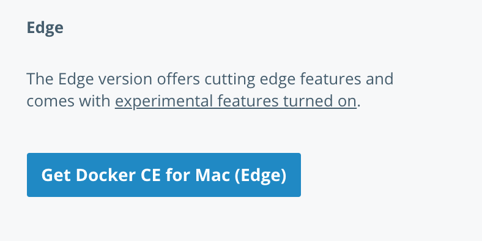
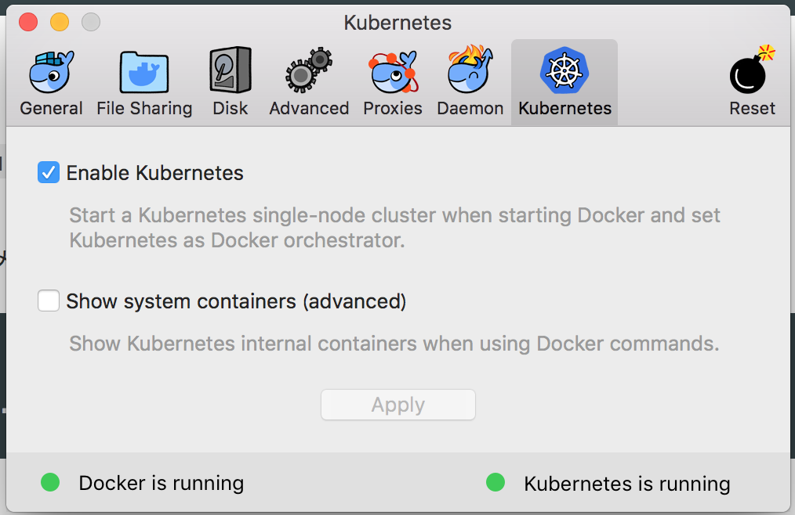

## Env

macのdocker cliのをEdgeバージョンにする。



enableにする



https://store.docker.com/editions/community/docker-ce-desktop-mac?tab=description


## CONTAINER REGISTRY

Google Cloud Platform に非公開 Docker イメージを保存して高速化を実現    
https://cloud.google.com/container-registry/?hl=ja    


# Dockerでコンテナを動かす

コンテナをデプロイするにはコンテナランタイムを使う。docker cliを使う。kuardというコンテナを起動し、コンテナの8080ポートをローカルの8080ポートにマッピング。

```
docker run -d --name kuard --publish 8080:8080 gcr.io/kuar-demo/kuard-amd64:1
curl http://localhost:8080
docker stop kuard
docker rm kuard
#メモリを制限して起動
docker run -d --name kuard --publish 8080:8080 gcr.io/kuar-demo/kuard-amd64:1 --memory 200m --memory-swap 1G
```

イメージを削除

```
docker rmi タグ
docker rmi イメージid
```

docker一通り消す時

```
docker stop [name]
docker rm [name]
docker kill $(docker ps)
docker rmi $(docker images)
docker ps --all
```

pods消す

```
kubectl delete pod [name]
```

クラスタの診断

```
kubectl get componentstatuses
```

## Pod作成


```
#kuardサーバを動かす
kubectl run kuard --image=gcr.io/kuar-demo/kuard-amd64:1
#podのステータス
kubectl get pods
#podを削除
kubectl delete pod deployments/kuard
```

## Podマニフェスト作成

```
#pod起動
docker run -d --name kuard --publish 8080:8080 gcr.io/kuar-demo/kuard-amd64:1

```


```yaml:kuard-pod.yaml
apiVersion: v1
kind: Pod
metadata:
  name: kuard
spec:
  containers:
  - image: gcr.io/kuar-demo/kuard-amd64:1
    name: kuard
    ports:
        - containerPort: 8080
            name: http
            protocol:TCP
```

エラーが出てる。。

